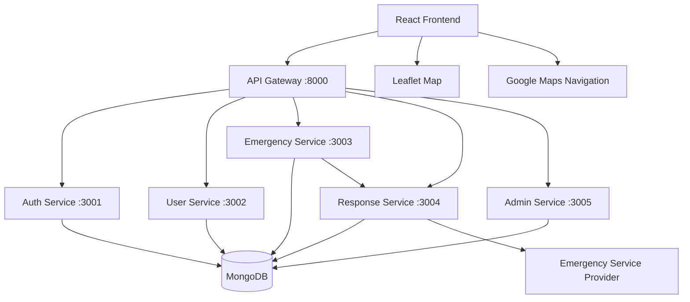

# Lifelink - Geospatial Emergency Dispatch System

Lifelink is a modern, microservices-based emergency response and coordination platform designed to connect people reporting emergencies with verified emergency service providers such as ambulances.

The system combines **real-time emergency dispatch, browser geolocation, MongoDB, microservices, provider verification, Leaflet mapping, Google Maps navigation, and live service monitoring** into a single platform.

The project is designed as an academic/prototype implementation demonstrating how a distributed emergency-response workflow can be coordinated through software.

---

## 🚑 Core Features

* 📍 **Automatic User Geolocation**

  * Detects the user's current latitude and longitude through browser geolocation.
  * Sends the location with the emergency request.
  * Displays the user's position on the map.

* 🚨 **Emergency Reporting**

  * Users can create emergency requests with relevant information.
  * Emergency requests are stored and processed through the backend.

* 🗺️ **Interactive Map**

  * Leaflet-based map interface.
  * Displays emergency locations and service-provider locations.
  * Supports geographic visualization of emergency-response activity.

* 🚑 **Verified Service Providers**

  * Providers register with:

    * Provider Name
    * Vehicle Registration Number
    * License ID
    * Phone Number
  * License IDs are automatically verified.

* 🔐 **Automatic License Verification**

  * A provider is considered valid when the License ID ends with:

    * `.service`
    * `.services`
  * Verification is case-insensitive.
  * Valid providers are automatically approved.
  * Invalid providers are automatically rejected.

* 🔔 **Live Emergency Alerts**

  * Available providers receive emergency notifications.
  * Emergency alerts include visual notification and alert sound.
  * Duplicate alerts are prevented.

* 🚦 **Dispatch Lifecycle**

  * AVAILABLE
  * DISPATCHED
  * ARRIVED
  * OFFLINE
  * COMPLETED / ARCHIVED

* 🧭 **Google Maps Navigation**

  * Providers can navigate directly to the emergency location.
  * The user's GPS coordinates are passed into Google Maps.

* 🖥️ **Admin Monitoring Dashboard**

  * Provides a read-only view of providers, emergencies and system activity.
  * Displays verification and availability states.
  * Shows live provider activity and emergency information.
  * No manual approval/rejection workflow is required.

* 🌐 **Multi-language UI**

  * English
  * Marathi
  * Hindi

* 🐳 **Dockerized Microservices**

  * Each major backend component runs as an independent service.
  * Docker Compose is used for local orchestration.

---

# 1. System Architecture



---

# 2. Technology Stack

## Frontend

* React
* JavaScript / JSX
* Vite
* Tailwind CSS
* Leaflet
* Browser Geolocation API

## Backend

* Node.js
* Express.js
* REST APIs
* JWT Authentication
* bcrypt password hashing

## Database

* MongoDB
* MongoDB Geospatial Queries
* `2dsphere` indexes
* GeoJSON Point coordinates

## Infrastructure

* Docker
* Docker Compose

## Mapping & Navigation

* Leaflet
* Map tile providers
* Google Maps Directions deep links

---

# 3. Microservices

Lifelink is divided into multiple backend services.

## API Gateway - Port 8000

Acts as the central entry point for frontend API requests.

Responsibilities:

* Routes API requests to the appropriate microservice.
* Provides a unified backend entry point for the React frontend.
* Handles communication between frontend and backend services.

---

## Auth Service - Port 3001

Responsible for authentication and provider registration.

Responsibilities:

* User registration
* User login
* JWT generation
* Authentication
* Password hashing
* Provider verification
* License validation

### License Verification Rule

A provider License ID is considered valid if it ends with:

```text
.service
```

or

```text
.services
```

The validation is case-insensitive and ignores surrounding whitespace.

Example:

```text
MH12AMB123.service
```

Valid.

```text
MH12AMB123.services
```

Valid.

```text
MH12AMB123
```

Invalid.

### Verification Results

For a valid provider:

```text
verificationStatus = APPROVED
status = APPROVED
availability = AVAILABLE
```

For an invalid provider:

```text
verificationStatus = REJECTED
status = REJECTED
availability = OFFLINE
```

The invalid-license response is:

```text
Verification failed: License ID must end with .service or .services
```

The verification process is automatic and does not require manual admin approval.

---

# 4. User Service - Port 3002

Responsible for user-related functionality.

Responsibilities include:

* User information
* User profile management
* User identification
* User-related API operations

---

# 5. Emergency Service - Port 3003

Responsible for creating and managing emergency requests.

Responsibilities include:

* Creating emergency requests
* Storing emergency information
* Recording user GPS coordinates
* Managing emergency state
* Providing emergency data to the response system
* Maintaining emergency history

Emergency location data is stored using GeoJSON coordinates.

Example:

```json
{
  "type": "Point",
  "coordinates": [
    73.8567,
    18.5204
  ]
}
```

The coordinate order is:

```text
[longitude, latitude]
```

---

# 6. Response Service - Port 3004

Responsible for emergency dispatch and provider-side response handling.

Responsibilities:

* Detecting available emergency providers
* Dispatching emergency requests
* Assigning emergencies
* Provider acceptance
* Provider navigation
* Arrival confirmation
* Emergency completion
* Provider availability updates

The service also ensures that dispatch operations are handled safely so that multiple providers do not incorrectly accept the same emergency.

---

# 7. Admin Service - Port 3005

Provides administrative monitoring functionality.

The Admin Dashboard is primarily designed as a **live monitoring interface**.

It can display:

* Registered providers
* Verification status
* Provider availability
* Emergency requests
* Dispatch states
* Assigned services
* Provider information
* System activity

The current implementation does **not** depend on a manual "Approve Provider" workflow.

Provider verification is performed automatically when the provider registers or updates their information.

---

# 8. MongoDB Data Model

The system uses MongoDB as its primary database.

Major entities include:

## User

Typical fields include:

```text
name
email
password
role
phone
```

---

## Service / Provider

Typical fields include:

```text
providerName
type
vehicleRegistrationNumber
licenseId
phoneNumber
availability
verificationStatus
location
```

Possible availability states include:

```text
AVAILABLE
DISPATCHED
ARRIVED
OFFLINE
```

Possible verification states include:

```text
APPROVED
REJECTED
```

---

## Emergency

Typical emergency information includes:

```text
emergencyType
description
location
status
assignedServiceId
userId
```

Emergency location is stored as GeoJSON.

---

# 9. Geospatial System

One of the major features of Lifelink is location-based emergency dispatch.

MongoDB geospatial functionality is used to work with latitude and longitude coordinates.

A `2dsphere` index can be used for geographic queries.

Example:

```javascript
{
  location: {
    type: "Point",
    coordinates: [longitude, latitude]
  }
}
```

This allows the system to work with real-world geographic coordinates and identify nearby emergency service providers.

---

# 10. Emergency Location Flow

The user's location follows this flow:

```text
User Browser
     ↓
Browser Geolocation API
     ↓
Latitude + Longitude
     ↓
Emergency Request
     ↓
Emergency Service
     ↓
MongoDB
     ↓
Response / Dispatch Service
     ↓
Provider Dashboard
     ↓
Google Maps Navigation
```

This allows the same emergency coordinates to be used throughout the dispatch process.

---

# 11. Emergency Dispatch Flow

The overall emergency workflow is:

```text
1. User opens Lifelink
        ↓
2. Browser detects user's location
        ↓
3. User reports an emergency
        ↓
4. Emergency is stored in MongoDB
        ↓
5. Response service identifies available provider
        ↓
6. Provider receives emergency notification
        ↓
7. Provider accepts emergency
        ↓
8. Provider state becomes DISPATCHED
        ↓
9. Provider opens navigation
        ↓
10. Google Maps navigates to emergency coordinates
        ↓
11. Provider marks ARRIVED
        ↓
12. Emergency is completed
        ↓
13. Provider becomes AVAILABLE again
```

---

# 12. Provider Registration Flow

Provider registration follows an automatic verification workflow.

```text
Provider Registration
        ↓
Provider submits:
- Provider Name
- Vehicle Registration Number
- License ID
- Phone Number
        ↓
License Validation
        ↓
       / \
      /   \
   VALID  INVALID
     ↓       ↓
 APPROVED  REJECTED
     ↓       ↓
AVAILABLE  OFFLINE
```

### Valid License

A License ID ending with `.service` or `.services` is accepted.

The provider can immediately become available for dispatch.

### Invalid License

The provider is rejected automatically.

The system displays:

```text
Verification failed: License ID must end with .service or .services
```

---

# 13. Provider Availability Lifecycle

Providers can move through multiple operational states.

```text
AVAILABLE
    ↓
DISPATCHED
    ↓
ARRIVED
    ↓
COMPLETED
    ↓
AVAILABLE
```

If a provider is unavailable:

```text
OFFLINE
```

This allows the dispatch system to distinguish between providers who are available, responding to an emergency, have arrived, or are offline.

---

# 14. Emergency Alert System

When an emergency becomes available to a provider, the provider dashboard displays a prominent alert.

The alert includes:

* Emergency information
* Location
* Alert notification
* Visual attention indicator
* Alert sound

The system prevents the same emergency from repeatedly triggering duplicate notifications.

The alert is designed to make incoming emergencies immediately noticeable to the service provider.

---

# 15. Navigation System

After accepting an emergency, the provider can use the navigation functionality.

The system generates a Google Maps Directions URL using the emergency's latitude and longitude.

Conceptually:

```text
https://www.google.com/maps/dir/?api=1&destination=LAT,LNG
```

The destination is generated dynamically from the emergency location.

This allows the provider to move directly from the Lifelink dashboard to Google Maps navigation.

---

# 16. Interactive Map

Lifelink uses Leaflet for geographic visualization.

The map can display:

* User location
* Emergency location
* Ambulance/service-provider locations
* Geographic activity
* Provider information

The map provides a visual representation of the emergency-response environment rather than relying only on textual coordinates.

---

# 17. Authentication

Authentication is handled using JWT-based authentication.

General flow:

```text
User Login
    ↓
Backend Authentication
    ↓
Credentials Verified
    ↓
JWT Generated
    ↓
Frontend Stores Authentication State
    ↓
Protected API Requests
```

Passwords are handled using secure hashing rather than storing plaintext passwords.

---

# 18. API Structure

The API is organized around the different microservices.

The API Gateway exposes the backend through:

```text
/api/...
```

Major API areas include:

```text
/api/auth
/api/users
/api/emergencies
/api/services
/api/admin
```

The exact route implementations are maintained inside their respective microservices.

---

# 19. Service-to-Service Communication

Because the application uses Docker Compose, backend services communicate with each other using Docker service names and environment-based configuration.

Inside Docker:

```text
auth-service
user-service
emergency-service
response-service
admin-service
mongodb
```

Services should not rely on `localhost` for communication with another container.

For example:

```text
response-service → emergency-service
```

uses the Docker service/network configuration rather than:

```text
localhost
```

This allows the architecture to work correctly inside the Docker network.

---

# 20. Project Structure

A simplified project structure is:

```text
lifelink-emergency-dispatch/
│
├── frontend/
│   ├── src/
│   │   ├── pages/
│   │   │   ├── UserDashboard.jsx
│   │   │   ├── ServiceDashboard.jsx
│   │   │   ├── AdminDashboard.jsx
│   │   │   └── Register.jsx
│   │   │
│   │   └── ...
│   │
│   ├── package.json
│   └── ...
│
├── services/
│   │
│   ├── auth-service/
│   │   ├── index.js
│   │   ├── license.js
│   │   ├── license.test.js
│   │   └── ...
│   │
│   ├── user-service/
│   │   └── ...
│   │
│   ├── emergency-service/
│   │   ├── index.js
│   │   ├── models/
│   │   └── ...
│   │
│   ├── response-service/
│   │   ├── index.js
│   │   ├── license.js
│   │   ├── models/
│   │   └── ...
│   │
│   └── admin-service/
│       ├── index.js
│       ├── models/
│       └── ...
│
├── docker-compose.yml
├── .gitignore
├── LICENSE
└── README.md
```

---

# 21. Running the Project

## Prerequisites

Install:

* Docker Desktop
* Docker Compose
* Node.js
* npm
* Git

---

## Start Backend Services

From the project root:

```bash
docker-compose up --build
```

This starts the required backend services and MongoDB.

---

## Start Frontend

Open another terminal:

```bash
cd frontend
npm install
npm run dev
```

The Vite development server normally runs at:

```text
http://localhost:5173
```

The API Gateway runs on:

```text
http://localhost:8000
```

---

# 22. Example End-to-End Scenario

### Step 1 - Provider Registration

A service provider opens the registration page.

They enter:

```text
Provider Name
Vehicle Registration Number
License ID
Phone Number
```

---

### Step 2 - Automatic Verification

The system checks the License ID.

For example:

```text
MH12AMB001.service
```

The provider passes verification.

The provider becomes:

```text
APPROVED
AVAILABLE
```

---

### Step 3 - User Reports Emergency

A normal user opens the User Dashboard.

The browser detects their location.

The user submits an emergency.

The emergency contains the user's geographic coordinates.

---

### Step 4 - Emergency Processing

The Emergency Service stores the emergency.

The Response Service processes the dispatch.

---

### Step 5 - Provider Alert

The available provider receives an emergency alert.

The dashboard displays the incoming emergency.

---

### Step 6 - Provider Accepts

The provider accepts the emergency.

The provider state changes to:

```text
DISPATCHED
```

---

### Step 7 - Navigation

The provider clicks Navigate.

Google Maps opens with the emergency coordinates as the destination.

---

### Step 8 - Arrival

After reaching the location, the provider marks:

```text
ARRIVED
```

---

### Step 9 - Completion

After completing the emergency:

```text
COMPLETED
```

The provider can become:

```text
AVAILABLE
```

again for future emergencies.

---

# 23. Testing

The project contains automated tests for important backend functionality.

For example, license validation can be tested using:

```bash
npm test
```

or the relevant service-specific test command.

Tests should cover important cases such as:

```text
.service
.services
uppercase extensions
mixed-case extensions
invalid extensions
missing license IDs
whitespace around license IDs
```

---

# 24. Security Considerations

The project demonstrates several security practices:

* JWT-based authentication
* Password hashing using bcrypt
* Protected API routes
* Environment-based configuration
* No hard-coded production secrets
* Validation of provider registration data
* Automatic provider verification

API keys and secrets should never be committed to GitHub.

Sensitive configuration should be stored in environment variables.

Example:

```text
.env
```

should generally not be committed.

Instead, projects can provide:

```text
.env.example
```

containing placeholder values.

---

# 25. Git & Repository Hygiene

The repository should not contain generated or sensitive files such as:

```text
node_modules/
dist/
.vite/
__pycache__/
*.pyc
.pytest_cache/
.env
*.log
```

These should be excluded using `.gitignore`.

Before committing changes, verify that:

* No API keys are exposed.
* No passwords are committed.
* No `.env` files containing secrets are committed.
* `node_modules` is not being tracked.
* Build/generated files are excluded.
* Only relevant source files are committed.

---

# 26. Design Philosophy

Lifelink focuses on demonstrating how modern software architecture can be applied to emergency-response coordination.

The project combines:

```text
Frontend
    +
Microservices
    +
Authentication
    +
Geospatial Data
    +
Automatic Verification
    +
Emergency Dispatch
    +
Live Monitoring
    +
Navigation
```

The objective is to create a technical prototype showing how emergency information can move from a user to a verified service provider through a distributed software system.

---

# 27. Future Improvements

Potential future improvements include:

* Real-time WebSocket event streaming across all dashboards
* Live ambulance GPS tracking
* Route optimization
* Traffic-aware dispatch
* ETA calculation
* Multiple ambulance coordination
* Police and fire-service support
* Hospital availability integration
* Emergency priority classification
* Push notifications
* SMS notifications
* Voice-based emergency reporting
* Offline/poor-network support
* Advanced geospatial indexing
* Analytics dashboard
* Historical emergency heatmaps
* Service response-time analytics
* Production-grade authentication and authorization
* Cloud deployment
* Kubernetes-based orchestration

---

# 28. Safety & Scope

Lifelink is an academic/prototype emergency coordination system.

It is intended to demonstrate:

* Software architecture
* Microservices
* Geospatial systems
* Emergency dispatch workflows
* Location-aware applications
* Provider verification
* Real-time/live monitoring concepts

It should not be treated as a replacement for official emergency services or professional emergency-dispatch infrastructure.

For real emergencies, users should contact the appropriate official emergency services.

---

# 29. Project Highlights

The project demonstrates several industry-relevant concepts:

```text
React
Node.js
Express.js
MongoDB
Docker
Microservices
REST APIs
JWT
bcrypt
GeoJSON
MongoDB Geospatial Queries
Leaflet
Browser Geolocation
Google Maps Integration
Automatic Verification
Emergency Dispatch
State Management
Live Monitoring
```

---

# 30. Project Goal

The long-term goal of Lifelink is to explore how software engineering, geospatial technology, distributed systems, and intelligent dispatch workflows can contribute to faster and more coordinated emergency response.

```text
Locate → Verify → Dispatch → Navigate → Respond → Complete
```

---

## Project Status

🚀 **Current Status: Functional End-to-End Prototype**

The current implementation includes:

* User registration/login
* Provider registration
* Automatic provider verification
* Emergency creation
* Browser geolocation
* MongoDB-backed emergency data
* Provider availability
* Emergency dispatch
* Provider acceptance
* Dispatch lifecycle
* Interactive map
* Google Maps navigation
* Admin monitoring dashboard
* Multi-language interface
* Docker-based microservice architecture

---

# 31. License


See the [LICENSE](LICENSE) file for the full license text.
