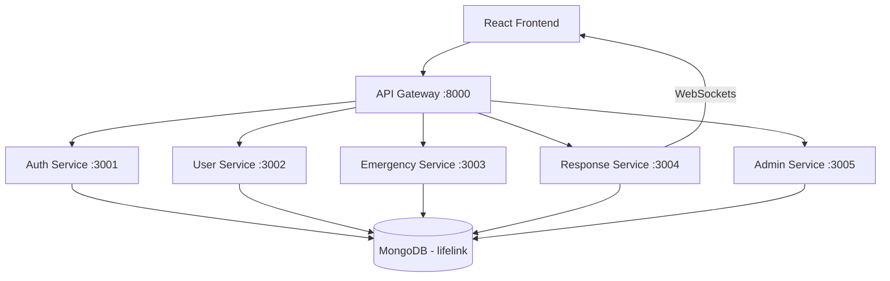

# Lifelink - Geospatial Emergency Dispatch System

Lifelink is a modern, microservices-based emergency response and coordination platform. It operates conceptually similar to an Uber/Ola-style dispatch system: when an emergency occurs, it automatically uses **MongoDB Geospatial queries** to find and notify the nearest verified emergency service (Ambulance, Police, Fire), bypassing the need for a centralized manual dispatch team.

## 1. Architecture Diagram



## 2. Microservices Explanation

- **API Gateway**: The single entry point for the frontend, running on port 8000. It proxies requests to the respective microservices.
- **Auth Service**: Handles user and service provider registration, login, password hashing (bcrypt), and JWT token generation.
- **User Service**: Manages basic user profile information.
- **Emergency Service**: Handles the creation and tracking of emergency incidents. When a new emergency is reported, it communicates with the Response Service to trigger dispatch.
- **Response Service**: Manages Service Providers (Ambulances, Fire, Police). Tracks their real-time location and availability. Uses WebSockets to broadcast nearby emergencies to available providers.
- **Admin Service**: Used by administrators to view the entire system state and approve/reject pending service provider registrations.

## 3. MongoDB Schema

All services connect to a single MongoDB database (`lifelink`), maintaining logical separation of collections.

**User Collection**
- `name`, `email`, `password`, `role` (USER, SERVICE_PROVIDER, ADMIN), `phone`

**Service Collection**
- `providerName`, `type` (AMBULANCE, POLICE, FIRE)
- `availability` (AVAILABLE, BUSY, OFFLINE)
- `verificationStatus` (PENDING, APPROVED, REJECTED)
- `location`: GeoJSON Point

**Emergency Collection**
- `emergencyType`, `description`, `status` (SEARCHING, ASSIGNED, RESOLVED)
- `location`: GeoJSON Point
- `assignedServiceId` (Reference to Service)

## 4. Geospatial Indexing Explanation

We use MongoDB's `2dsphere` index to enable ultra-fast, location-aware queries.
Both the `Emergency` and `Service` collections have a `2dsphere` index on their `location` fields.

When an emergency occurs, the Response Service uses the `$near` operator:
```javascript
Service.find({
  location: {
    $near: {
      $geometry: { type: "Point", coordinates: [longitude, latitude] },
      $maxDistance: 5000 // meters
    }
  },
  availability: 'AVAILABLE',
  verificationStatus: 'APPROVED'
});
```
This instantly finds all available, approved service providers within a 5km radius.

## 5. Emergency Dispatch Flow

1. **User Reports Emergency**: User taps "Report Emergency" (browser geolocation API grabs lat/lng).
2. **Emergency Created**: Emergency Service saves the incident with GeoJSON coordinates.
3. **Trigger Dispatch**: Emergency Service tells Response Service to find nearby units.
4. **MongoDB `$near` Search**: Response Service queries MongoDB for nearby `AVAILABLE` and `APPROVED` services.
5. **WebSocket Notification**: Response Service emits a `new_emergency` Socket.IO event to those specific nearby providers.
6. **Provider Accepts**: A provider clicks "Accept". The service becomes `BUSY` and the emergency becomes `ASSIGNED`.

## 6. API Endpoints

### Auth
- `POST /api/auth/register`
- `POST /api/auth/login`
- `GET /api/auth/me`

### Users
- `GET /api/users/:id`
- `PUT /api/users/:id`

### Emergencies
- `POST /api/emergencies` (Create emergency)
- `GET /api/emergencies/user/:userId` (Get user's history)
- `PATCH /api/emergencies/:id/status` (Update status)

### Services / Response
- `POST /api/services/register` (Register a new service)
- `PATCH /api/services/:id/status` (Update availability and location)
- `POST /api/services/dispatch` (Internal trigger to find nearby services)
- `POST /api/services/:id/accept` (Accept an emergency)

### Admin
- `GET /api/admin/services/pending`
- `PATCH /api/admin/services/:id/approve`
- `PATCH /api/admin/services/:id/reject`

## 7. Authentication Flow

1. User/Provider/Admin logs in via Auth Service.
2. Server validates credentials and signs a JWT (JSON Web Token).
3. Token is stored in the browser's `localStorage`.
4. Subsequent requests to protected routes use this token (though in this simplified version, the frontend manages access via state).

## 8. Admin Verification Flow

To prevent malicious users from acting as fake ambulances, all newly registered Service Providers start with `verificationStatus = 'PENDING'`. 

They cannot participate in dispatch (the `$near` query explicitly filters for `APPROVED`) until an Admin logs into the Admin Dashboard and clicks **Approve**. 

## 9. How to run the project locally

**Prerequisites**: Docker, Docker Compose, Node.js

1. Clone the repository and navigate to the root directory.
2. Run the Docker Compose stack to start MongoDB and all backend microservices:
   ```bash
   docker-compose up --build
   ```
3. Open a new terminal and navigate to the frontend folder:
   ```bash
   cd frontend
   npm install
   npm run dev
   ```
4. Access the application at `http://localhost:5173`. (API Gateway runs on `http://localhost:8000`).

## 10. Example Emergency-Dispatch Scenario

1. Open `http://localhost:5173`. Register an account as an **Administrator** (Role: ADMIN).
2. Open a new incognito window. Register an account as a **Service Provider** (Role: SERVICE_PROVIDER). Register your ambulance and allow location access.
3. In the Admin window, go to the dashboard and **Approve** the new ambulance.
4. In the Provider window, click **GO AVAILABLE**.
5. Open another incognito window. Register as a **Normal User** (Role: USER).
6. As the Normal User, click **Report Emergency**.
7. Instantly, the Service Provider window will receive a flashing red notification and an alert via WebSockets because they are nearby.
8. The Provider clicks **Accept**, changing their status to BUSY and updating the user's view.
